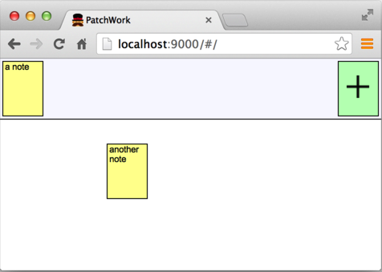
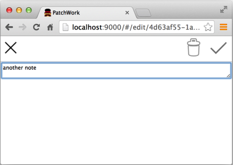

This software is released under GNU General Public License v3 (http://www.gnu.org/licenses/gpl-3.0.txt)

PatchWork
=========

Copyright © 2014 Dag Rende

This is a web version of the sticky notes board.

* You create notes and place them on the board
* All browsers showing the same board sees all changes in real-time
* Works with desktops and mobile devices

# Use-cases

* Open a board in a web page
* Create note and write text - it ends up in your note list
* Place note on board - move note from your list to the right position on the board
* Move placed note
* Un-place note - moving it to your note list
* Edit note text in note list or board
* Leave board by closing web page or navigating to web page

# Implementation

## Tools

* HTML5
* AngularJS - general framework
* Socket.io - for communicating changes to other users

## Compatibility goals

### Must

* Chrome desktop
* Firefox
* Chrome Android
* Safari desktop
* Safari iOS

### Hopefully also

* IE7+

## Object model

* Board
    * notes
    * boardNotes
* Note
    * id
    * text
* BoardNote
    * note
    * x, y

## Architecture

### Note identity

As notes should be unique among all clients, GUIDs are used as IDs. Each note get a GUID at
creation and keeps it in all clients throughout the board life-time.

### Client

* BoardController
    * Listens to BoardModel changes and updates the user interface
* BoardModel
    * Maintains the Board, Notes, BoardNotes etc
* RemoteEnabler
    * Listens to method calls to BoardModel and uses the transceiver to send them in JSON form to server
    * Calls BoardModel methods for JSON messages received from the transceiver
* SocketIoTransceiver
    * Communicates with server using [Socket.io](http://socket.io)

## User Interface

- Top row shows the notes that have not been placed on the board. Click on the green note to create a new note and type a text in the note editor to create a new note.
- Drag a note from the top down to the board to place it. Drag from board to top row to return it to remove it from the board.
- Click on note in top row or in board to edit the text.

- Edit the text in the text area
- Click  to save it
- Click  to cancel the change
- Click  to delete the note

 All the operations return to the board.

## Communication protocol

* Client sends all model changes as JSON objects to the server
* Server saves all received messages in a board log and broadcasts them to all except the sender
* When a client connects to the server, the server sends back all messages in the board log

### Client to server

{methodName: 'createNote', args: [{text: ''}],
  result: '4d4b59f7-20c1-4064-8f92-4271f232d1e0'}

{methodName: 'setNoteAttr',
  args: ['4d4b59f7-20c1-4064-8f92-4271f232d1e0', { text: 'hello' }]}

{methodName: 'placeNote',
  args: ['4d4b59f7-20c1-4064-8f92-4271f232d1e0', 108, 47.234375]}

{methodName: 'unplaceNote',
  args: ['4d4b59f7-20c1-4064-8f92-4271f232d1e0']}

### Server to client

{methodName: 'createNote',
  args: [{ id: '4d4b59f7-20c1-4064-8f92-4271f232d1e0', text: '' }]}

{methodName: 'setNoteAttr',
  args: ['4d4b59f7-20c1-4064-8f92-4271f232d1e0', { text: 'hello' }]}

{methodName: 'placeNote',
  args: ['4d4b59f7-20c1-4064-8f92-4271f232d1e0', 108, 47.234375]}

{methodName: 'unplaceNote',
  args: ['4d4b59f7-20c1-4064-8f92-4271f232d1e0']}

